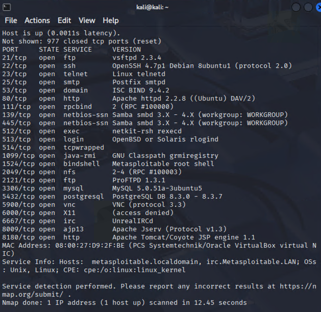

# Домашнее задание к занятию "`Уязвимости и атаки на информационные системы`" - `Кошель Николай Павлович`

### Задание 1

Скачайте и установите виртуальную машину Metasploitable: https://sourceforge.net/projects/metasploitable/.

Это типовая ОС для экспериментов в области информационной безопасности, с которой следует начать при анализе уязвимостей.

Просканируйте эту виртуальную машину, используя **nmap**.

Попробуйте найти уязвимости, которым подвержена эта виртуальная машина.

Сами уязвимости можно поискать на сайте https://www.exploit-db.com/.

Для этого нужно в поиске ввести название сетевой службы, обнаруженной на атакуемой машине, и выбрать подходящие по версии уязвимости.

Ответьте на следующие вопросы:

- Какие сетевые службы в ней разрешены?

- Какие уязвимости были вами обнаружены? (список со ссылками: достаточно трёх уязвимостей)
https://www.exploit-db.com/exploits/16922
https://www.exploit-db.com/exploits/16859
https://www.exploit-db.com/exploits/17491
https://www.exploit-db.com/exploits/18368

### Задание 2

Проведите сканирование Metasploitable в режимах SYN, FIN, Xmas, UDP.

Запишите сеансы сканирования в Wireshark.

Ответьте на следующие вопросы:

- Чем отличаются эти режимы сканирования с точки зрения сетевого трафика?

SYN: односторонний трафик, видно что отправляется SYN, а ответы — SYN-ACK или RST.
FIN: в основном одно направление — FIN или RST. Необычное поведение для обычного соединения.
Xmas: пакеты "елки", с несколькими флагами — FIN, PSH, URG.
UDP: большинство пакетов — UDP без установления TCP-соединения.

- Как отвечает сервер?

SYN-сканирование: сервер отвечает SYN-ACK (открыт) или RST (закрыт).
FIN и Xmas-сапат: открытые порты могут не отвечать, закрытые — RST.
UDP: ответ — отсутствие ответа (иногда ICMP Port Unreachable).

//команды

1. Сканирование SYN (полустатусное сканирование)
Команда:
nmap -sS ip

Режим: Отправляется TCP-пакет с флагом SYN, сервер отвечает:
SYN-ACK — порт открыт
RST — порт закрыт или фильтрован

2. Сканирование FIN
Команда:
nmap -sF ip

Режим: Отправляется TCP-пакет с флагом FIN, сервер отвечает:
RST — порт закрыт или фильтрован
Нет ответа — порт открыт или фильтрован (так как открытые порты на этом режиме обычно не отвечают)

3. Xmas-сканирование
Команда:
nmap -sX ip

Режим: Отправляется TCP-пакет с флагами FIN, PSH и URG. Ответы аналогичны FIN-сканированию.

4. UDP-сканирование
Команда:
nmap -sU ip_метасприботы

Режим: Отправляются UDP-пакеты, ответы:
Нет ответа — порт открыт или фильтрован
ICMP Port Unreachable — порт закрыт
